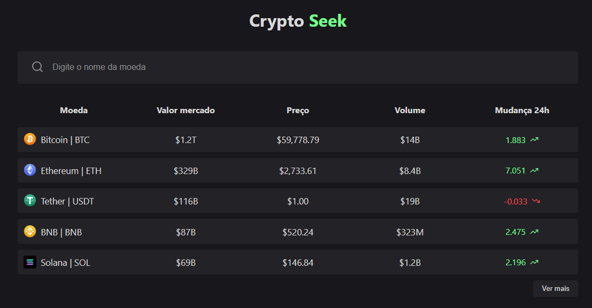
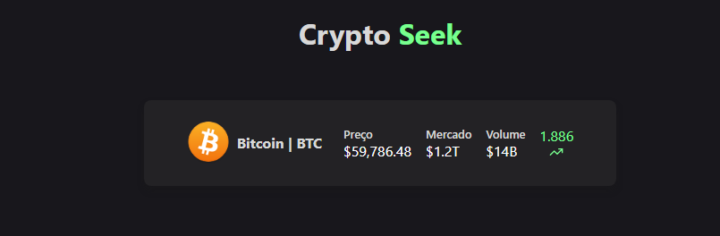

Status: Completo 🚀

 <div>

## Crypto Seek

Crypto Seek é uma aplicação web projetada para acompanhar as tendências do mercado de criptomoedas. A ferramenta permite que você identifique rapidamente quais criptomoedas estão em alta ou em baixa, oferecendo análises detalhadas e informações relevantes para entusiastas e investidores que buscam tomar decisões informadas no mundo das criptomoedas.

## Funcionalidades:

- Lista as criptomoedas disponíveis e exibe suas informações a partir de uma API.
- Permite a busca por criptomoedas específicas.
- Exibe uma tela com detalhes para cada criptomoeda.

<br/>
<br/>

 <div>
<br/>
<br/>
 <div>

<hr/>

## 💻 Tecnologias Utilizadas:

- React
- husky
- Eslint
- Prettier
- Typescript

<hr/>

## 🚀 Projeto no ar

<a href="https://crypto-seek.vercel.app/">Acesse aqui</a>

## ⚙️ Como Executar

- Faça um clone do repositório do projeto no GitHub.
- Navegue até o diretório do projeto.
- Execute o seguinte comando para instalar as dependências:

```
$ npm install
```

## Running the project

```
$ npm run dev
```
